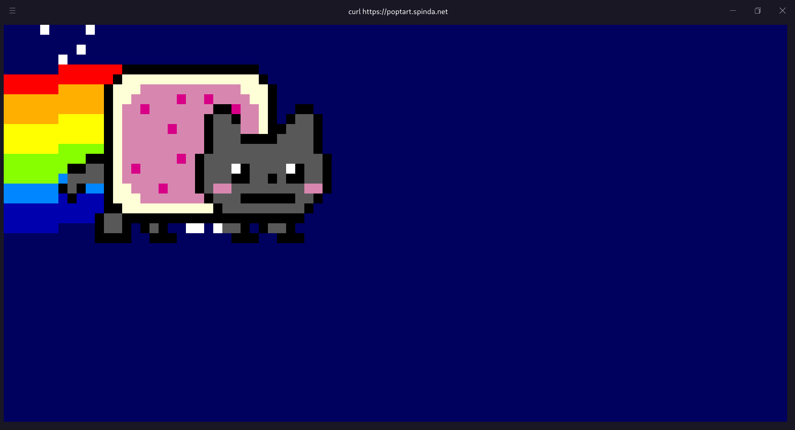

## 前言

本文所有内容均在 bash 下进行，在没有特殊说明的情况下 shell 都是指 bash。 \
一部分内容在 zsh 中会有差异 (存在差异时会指出) \
其中尽可能是 shell 的功能，而非某一个软件包所实现的功能 \
本文的内容默认读者对 shell 已经有一定了解，诸如 `$?` 或者 `##` 这些的含义本文不会赘述。 \
对于对 shell 不太了解的读者，只希望了解一点点实用技巧，可以阅读 [实用技巧]() \

## 奇淫巧技

记录了一些奇奇怪怪、较少使用，但很有趣指令、操作等。 \
较为实用的部分在 [实用技巧]() \
好玩的指令在 [just-for-fun]()

### $_ 与 :

bash 圣经中的第一个代码示例如下:
```bash
trim_string() {
    # Usage: trim_string "   example   string    "
    : "${1#"${1%%[![:space:]]*}"}"
    : "${_%"${_##*[![:space:]]}"}"
    printf '%s\n' "$_"
}
```
对于字符串的操作比较基础，也有许多文档了，关注点在 `:` 和 `$_` 上。 \
`:` 除了扩展后面的那一堆和重定向外，不会执行其他操作[^1]，这里的重定向包括输出到 stdout，并且不会输出。 \
`$_` 和其他脚本语言 (python 之类的) 类似，表示上一个指令执行的结果[^2] \
通过这些就可以写一些有趣的代码:

[^1]: 这意味着类似于 `: echo "e"` 是会执行的，而 `: mkdir a` 是不会执行的。
[^2]: 在诸如 python 的脚本语言中，`_` 一般上是上一个表达式的值。

```bash
Ծ‸Ծ(){
    sleep 0.1
    printf '\e[15D'
    printf "\e[38;5;$2m"
    printf $1
    : "${_:0-1:1}""${_:0:14}"
    if [[ $2 -eq 256 ]]
    then Ծ‸Ծ $_ 1
    else Ծ‸Ծ $_ $[$2 + 1]
    fi
}
printf '\e[?25l'
: echo $(echo "4paB4paC4paD4paE4paF4paG4paH4paI4paH4paG4paF4paE4paD4paC4paBCg==" | base64 -d)
Ծ‸Ծ $_ 1
```

这段程序在 zsh 中不能正确运行。 \
其中诸如 `\e[?25l` 是终端控制符，可以在下文找到说明。

### 模式扩展

不使用 `pwd` 该如何获取当前所在目录呢，方法很多

1. 使用 `$PWD` 变量[^3]
2. 使用 `dirname $(readlink -f $0)` 这样的神奇的指令[^4]
3. 使用 `readlink -f .` 等等[^5]

[^3]: `$PWD` 永远指向当前目录，但 `pwd` 指令并不是单纯的输出 `$PWD` 变量。
[^4]: `$0` 表示的是当前所使用的 shell 的可执行文件位置。在 bash 中如果用 `readlink -f` 去读却会得到 `$PWD/bash`。
但在 zsh 中会指向类似于 `/usr/bin/zsh` 这样的位置。
[^5]: 每个目录都有两个特殊目录 `.` 和 `..`，这也是为什么 `cd ..` 这样的指令能工作的原因。

但显得更加 "奇淫巧技" 的是 `echo ~+` \
实际上这是 shell 的模式扩展 (globbing)，`~+` 默认扩展成当前目录。 \
类似例子还有很多，比如 `~username` 扩展成 username 用户的主目录。为空则默认为当前用户，这就是为什么 `~` 表示当前用户的主目录了。 \
而众所周知 `*` 可以匹配除了点以外的任意字符多次，实际上开启 `dotglob` 后点也可以匹配到，比如:
目录如下:
```
a
├── test1
│   ├── test3.txt
│   └── test4.txt
├── test2
│   ├── test5.txt
│   └── test6.txt
├── .what
└── .why
    ├── .emmm
    └── emmm
```
在 `a` 目录下:
```
$ ls *
test1:
test3.txt  test4.txt

test2:
test5.txt  test6.txt
$ shopt -s dotglob
$ ls *
.what

test1:
test3.txt  test4.txt

test2:
test5.txt  test6.txt

.why:
emmm
```
`{} []` 这些东西可以匹配字符，实际上开启了 `extglob` 之后还可以设置匹配的次数

更多的内容可以在 google 上找到，太多太长了，此处仅是抛砖引玉。


上面的输出可能和一般的 `ls` 指令的输出有点不太像，此处想表达的是扩展先于指令执行 \
在此处 `ls *` 会首先扩展成 `ls test1 test2` 和 `ls .what test1 test2 .why` \
即实际上输出的是多个目录下的文件。 \
值得注意的是，在 history 中仍然为 `ls *`


### 终端控制符

终端控制符与 shell 无关，能否显示与所使用的终端。 \
大部分常用的终端控制符在 bash 中的转义字符如下:

|操作|说明|
|-----|------|
|\e[38;5;<0-255>m	       | 设置文字颜色，256色                         |
|\e[48;5;<0-255>m	       | 设置背景色，256色                           |
|\e[38;2;[R];[G];[B]m      | 设置文字颜色，RGB	                         |
|\e[48;2;[R];[G];[B]m      | 设置背景颜色，RGB	                         |
|\e[m	                   | 恢复默认的颜色                              |
|\e[1m	                   | 加粗                                      |
|\e[2m	                   | 亮度减半                                   |
|\e[3m	                   | 斜体                                      |
|\e[4m	                   | 带下划线                                   |
|\e[5m	                   | Blinking 看起来就是加粗，我不清楚，翻译是闪烁   |
|\e[7m	                   | 背景变白 (高亮)                             |
|\e[8m	                   | 隐形，所有输出都会隐形！                      |
|\e[9m	                   | 带删除线                                   |
|\e[[y];[x]H               | 将光标移动到指定行列，缺省为当前值             |
|\e[H	                   | 将光标移动到 (0，0)	                     |
|\e[xA	                   | 将光标上移 x 行，缺省为1                     |
|\e[xB	                   | 将光标下移 x 行，缺省为1                     |
|\e[xC	                   | 将光标右移 x 行，缺省为1                     |
|\e[xD	                   | 将光标左移 x 行，缺省为1                     |
|\e[s	                   | 保存光标位置	                             |
|\e[u	                   | 恢复光标位置	                             |
|\e[K	                   | 将光标到行尾的所有内容擦除                    |
|\e[1K	                   | 擦除光标到行首的全部内容                      |
|\e[2K	                   | 擦除光标所在行的全部内容                      |
|\e[J	                   | 擦除光标所在行到屏幕底端的全部内容              |
|\e[1J	                   | 擦除光标所在行到屏幕顶端的全部内容              |
|\e[2J	                   | 擦除屏幕                                    |
|\e7                       | 保存光标位置                                 |
|\e8                       | 恢复光标位置                                 |
|\e[6n                     | 获取光标位置                                 |
|\e[?25l                   | 隐藏光标                                    |
|\e[?25h                   | 让光标显示出来                               |
|\e[?7l                    | 开启不折行，即字符会出现在屏幕外                |
|\e[?7h                    | 开启折行，当前行放不下时会放到下一行             |
|\e[[a];[b]r               | 限制只能在 a 行到 b 行滚动（很好玩，自己去试试）  |
|\e[?1049h                 | 保存整个屏幕的所有字符                        |
|\e[?1049l                 | 恢复用上一条指令保存的东西                     |

这些转义字符可以任意组合使用，比如 `\e[38;2;100;0;100m\e[3mfuck\e[m` 则是一个紫色的斜体 fuck


假如使用 echo 输出，那么需要开启 -e 参数或者下文描述的奇淫巧技，默认不会转义字符。 \
使用 printf 输出，则不需要任何参数，默认会转义字符。 \
其他的诸如 tput 自行测试


### !

`!` 这个东西相当有趣，不妨试试以下指令
```bash
echo !#
echo !!
```

不出所料的话，应该是这样的输出
```
$ echo !#
echo echo
echo
$ echo !!
echo echo echo
echo echo
```

实际上可用的 `!` 操作如下:
```bash
# 摘抄自 https://github.com/skywind3000/awesome-cheatsheets/blob/master/languages/bash.sh
!!                  # 上一条命令
!^                  # 上一条命令的第一个单词
!:n                 # 上一条命令的第n个单词
!:n-$               # 上一条命令的第n个单词到最后一个单词
!$                  # 上一条命令的最后一个单词
!-n:$               # 上n条命令的最后一个单词
!string             # 最近一条包含string的命令
!^string1^string2   # 最近一条包含string1的命令， 快速替换string1为string2
!#                  # 本条命令之前所有的输入内容
!#:n                # 本条命令之前的第n个单词， 快速备份cp /etc/passwd !#:1.bak
```
类似于宏，在执行之前就会替换掉，所以执行 `echo !#` 实际执行的是 `echo echo` 并且在 history 中也是如此。


另外不能用于脚本文件中，不能写~~装逼~~带有魔法的代码了。



### 转义

`echo -e` 可以开启输出转义，实际上另外一种方法却也是可以奏效的，那便是 `echo $'内容'` 这样的形式 \
举个例子 `echo $'\e[38;5;50m what\'s this'` 等价于 `echo -e "\e[38;5;50m what's this"` \
输出的都是一个蓝绿色的 `what's this`


不可以使用 $"s" 代替 $'s' ，此处单双引号不等价.


### trap

`trap` 在接收到指定的信号时，就会执行指定的指令 \
首先 `trap -l` 可以看到所有信号，或者 `trap --list-signals`
```
$ trap --list-signals
HUP INT QUIT ILL TRAP ABRT BUS FPE KILL USR1 SEGV USR2 PIPE ALRM TERM STKFLT
CHLD CONT STOP TSTP TTIN TTOU URG XCPU XFSZ VTALRM PROF WINCH POLL PWR SYS
```

其中 INT 表示 ctrl + c 时产生的信号，也可写成 SIGINT \
EXIT 不管怎么样，只要退出就会产生 \
那么搞事情的机会就来了，在脚本第一行加入如下指令，使用者不仅无法退出，还会在试图退出时看到 "略略略" :)

```bash
trap "echo '略略略';bash $0" EXIT
```

不影响正常运行，只在退出时输出并用 bash 执行当前文件，即重启脚本。

### LINENO

这个变量非常有趣，它的值为脚本执行时，该条指令所在的行号 \
比如一个脚本的内容如下:

```bash
a=123
b=456
echo $LINENO
```

输出为 3 \
另外，有趣的是，在平时使用的命令行中这个变量也是存在的

### 创建文件

相比于 `touch` 用于创建一个空文件，`: >`[^6] 可能显得更加牛逼一些。 \
更加丧心病狂的做法可能是 `: made_by_❤ > somefile` 去创建空的 `somefile` \
或者更更更加丧心病狂使用类似于 `: rm -rf / > somefile` 这样的指令，让人误以为是恶意指令。


此处的 `made_by_❤` 和 `rm -rf /` 并 **不会** 执行也 **不会** 写入到文件中，原因见 [$_ 和 :]() \
但请不要使用到可 globbing 的符号和重定向 (最简单的做法就是不用英文符号)


[^6]: `: > abc.txt` 实际上等价于 `: "" > abc.txt` 也就是利用 `:` 执行 `"" > abc.txt`

### 强制写入

有时会遇到这样奇怪的情况:
```
$ echo m > test.txt
bash: test.txt: cannot overwrite existing file
```

实际上这是因为开启了 noclobber 的缘故 (默认是关闭的，但可能有些脚本开启了它) \
我们固然可以关掉它，实际上还有一种解决方法，即使用 >| \
它们之间唯一的区别就是你有权写入该文件的情况下， >| 一定会写入，不管设置了什么 \
当然，重新开一个 shell 会更快解决问题，并且不用知道为什么，但多少有些无趣

## 实用技巧

### 快速编辑指令

这个并不属于 bash 特有的，但也一并放在这里 (其实应该是终端提供的功能，但就算是在纯的 tty 也能用)。 \
在敲指令的时候，有时候会发现忘记加 sudo 或者又是少了一个参数，但此时指令很长，按方向左键简直费时费力。 \
那有没有好办法快速跳转到行首呢？ \
当然有，按 ctrl + a 就可以直接将光标放到行首， ctrl + e 到行尾。 \
除此之外，还有很多快捷键可以使用，这里给出一些常用的:

ctrl + w 删除前一个单词，vim 中可用 \
ctrl + u 删除整行，vim 中可用

### 目录记录

`cd -` 是个非常厉害的指令，它的作用是退回你之前所在的目录


等价于 `cd $OLDPWD`，但对 $OLDPWD 赋值并不会影响 `cd -`


对于 `cd -`，只能回到上一次所在的目录，想要 bash 记录更多目录，可以使用 `pushd` 和 `popd`(那么就不是高效操作了)。

### 快速文件操作

有时候文件位于很深层的目录，这时候想去重命名的时候就显得非常麻烦了，指令大概类似于这样:
```bash
mv content/post/abc/img/xyz.png content/post/abc/img/abc.png
```

需要敲两遍路径，费时又费力。 \
利用 `cd -` 固然可以很快解决，一步跳进目录再一步跳出，感觉还是差点意思。 \
更好的解决办法:
```bash
mv content/post/abc/img/{xyz,abc}.png
```

当然，同样的方法可以利用在复制文件，修改后缀等等这些操作上，非常好用。

### 读取 read 结果

写 bash 脚本时，read 是很常用的指令。 \
但 read 有个极大的限制 —— 会默认按照 `$IFS` 分割 \
实际上可以使用 $REPLY 这个变量来处理 read 结果，它默认是上一次 read 所读取到的所有东西。 [^7]\
接着就是简简单单的字符串处理了。

[^7]: read 仍然受单行所限制，即 `cat some | {read; echo $REPLY }` 只能得到 some 中第一行的内容

### shift

写脚本时，处理参数有时候是件麻烦事，但所幸 shift 这个时候显得非常有用.

```bash
shift
echo $@
```

写入任意一个文件中，传入任意个参数，却只能得到除了第一个参数以外的所有参数，这是因为 `shift` 将原来的 $1 移除了，而原来的 $2 就成了 $1 \
这样就可以处理完一个参数，然后 `shift` 掉，接着处理子参数，`shift` 掉...


shift 可以多次调用，每次都是移除一个参数，也可以传入一个数字，控制移除的参数个数.


### \>\>>

日常使用中，很多都只是一个字符串，而有时候某个指令的参数是文件名，这种情况下该怎么办？ \
将字符串写入文件再进行操作？这样好麻烦啊。 \
实际上不用担心，因为有 <\<< \
拿 md5sum 来说，它接受文件名作为参数，实际上使用 `md5sum <<< string` 即可


`echo "string" | md5sum` 也是一样的，还更加实用一些 (不用思考)


### 参数终止

当目录下有个名为 -l 的目录时应该如何输出 -l 目录下的文件？ \
直接 `ls -l` 肯定是不行的，-l 会被当成是参数而非目标目录，那么试试如下代码呢:

```bash
a='-l'
ls $a
```

事实上这种办法看起来没问题，但其实还是不行。 \
难道是没有办法输出 -l 目录下的文件的办法吗？ \
非也，这里有一种参数终止的方法，使用 -\- 。 \
使用 `ls -- -l` 就可以输出 -l 目录下的内容了。


这个例子可能并不好，毕竟使用 `ls ./-l` 就好了。但在其他情况下，会有用到的时候，比如目标不是一个文件。 \
-\- 对 echo 无效


### 快速上一条指令

使用方向键来填充上一条指令是不错的选择。\
拥有同样效果的还有 !!，使用起来也很方便。 \
比如:
```bash
apt install vim # wrong! 非 root 用户无权执行
sudo !! # fine! 等价于 sudo apt install vim
```


在 zsh 中还有一个 r，但注意 `sudo r` 正常情况下不行，zsh 特有的。


### 快速修改上一条指令

在敲击命令中的过程中错误是很常见的事情，也有很多解决办法：zsh 的插件纠正， thefuck...... \
但其实无需其他的任何的程序，bash 中已经提供了一个 `^` \
比如，想要敲击 `sudo apt install vim` 但是敲成了 `sudi apt install vim`，bash 很直接地告诉我们指令错了。 \
那么此时只须执行 `^i^o`(意思是将第一个 i 替换为 o) 即可直接执行正确的指令:
```
$ sudi pacman -Syyu
bash: sudi：未找到命令
$ ^i^o
sudo pacman -Syyu
[sudo] nidhoggfgg 的密码：
```

### 快速粘贴参数

对于如下例子:
```
$ ls projects/fpig/fp/vm/src/
chunk.rs  lib.rs  object.rs  op.rs
$ cd projects/fpig/fp/vm/src/
```
其中需要两次敲击 `projects/fpig/fp/vm/src`，这需要敲很多键。 \
当然，可以利用前文所述的快速编辑，但仍然显得很麻烦。 \
实际上第二个路径不需要敲，只需要敲完 `cd ` 之后按下 `Alt + .` 就可以自动粘贴上一条指令的参数！ \
也就是:
```
$ ls projects/fpig/fp/vm/src/
chunk.rs  lib.rs  object.rs  op.rs
$ cd <Alt + .>
```
就可以直接自动补全了。

 这个例子或许不是很恰当，毕竟可以使用上述的小技巧 `^ls^cd` 一步完成 

### CDPATH

`CDPATH` 是一个特殊的环境变量，类似于 `PATH`，比如:
```
$echo $CDPATH
:/home/nidhoggfgg/projects
$cd fpig
$pwd
/home/nidhoggfgg/projects/fpig
```
第二步使用 `cd fpig` 就直接跳入了 `/home/nidhoggfgg/projects/fpig`，可以极大的节省时间。 \
建议填入常用的目录然后写入 ~/.zshrc 或者 ~/.bashrc

### 清除屏幕

`clear` 是个不错的选择，但或许用快捷键 ctrl + l 会更快

### 不匹配文件

有时候操作文件，跳过一些文件而不是选择一些文件可能更好，比如:
```bash
rm !(*.md|*.jpeg|*.jpg|*.png|abc.txt)
```
删除所有除了以 md, jpeg, jpg, png 结尾以及 abc.txt 以外的所有文件。 \
在 zsh 中无效，在 bash 中需要开启 `extglob`，即需要 `shopt -s extglob`

### 不保留历史记录

有时候会执行一些参数上带有隐私内容的指令，比如一些远程登陆等等，这时候并不想把这条指令留在历史记录里。 \
当然，写入文件里执行是不会被记录的，但未免太麻烦了。 \
难道没有其他办法吗？其实这也是有办法的。 \
最为简单的办法就是在指令前加一个空格，就可以做到了，如：
```
[space]echo "LOL"
```
其中的 `[space]` 表示一个空格。

还有很多通过操纵 history 来实现同样或者更强的效果的，用处不大此处不再赘述。

### cheatsheet

忘记命令的参数用法的事常有，但往往 `--help` 一大堆的输出里不能很快地找到需要的，更别说 `man` 动辄几十上百页的说明了。\
其实有一种更加简单的方式就是使用 cheatsheet 了。\
对于最轻量的使用方法，不用安装程序的就是使用 `curl` 了，比如:
```bash
curl cheat.sh/ls
```
将以下几行添加到 `~/.zshrc` 或者 `~/.bashrc` 会很有用:
```bash
how() {
    curl cheat.sh/$1
}
```
之后就可以使用 `how` 来查询不知道的指令的使用方法了。

### 查看系统及硬件信息

`lscpu`, `free`, `lsblk` 分别可以查看 cpu，内存，硬盘信息，他们的使用方法可以使用上述的 `how` 函数查询。 \
`/etc/issue` 里存储了 linux 发行版的名字，比如 `Manjaro Linux`

## just for fun

这里收集了一些好玩的，只是非常非常非常小的一部分，很多惊艳到我的都没记录下来。\
有一部分指令可能有一定的实用价值。

### 表情

输出所有的笑脸 [author: ichbins](https://www.commandlinefu.com/commands/by/ichbins)
```bash
printf "$(awk 'BEGIN{c=127;while(c++<191){printf("\xf0\x9f\x98\\%s",sprintf("%o",c));}}')"
```
原理是输出 "\xf0\x9f\x98\x80" (😀) 到 "\xf0\x9f\x98\xbe" (😾)。并用 awk 简化了一下，写成单行。 \
这也是不全的，比如在 U+1F910 到 U+1F917 也是笑脸，其他的还有。 \
同样的，还可以输出小动物 (改成了 16 进制，更加合理了!)
```bash
printf "$(awk 'BEGIN{c=127;while(c++<174){printf("\xf0\x9f\xa6\\x%s",sprintf("%x",c));}}')"
```
或者伏羲六十四卦
```bash
printf "$(awk 'BEGIN{c=133;while(c++<191){printf("\xf0\x9d\x8c\\x%s",sprintf("%x",c));}}')"
printf "$(awk 'BEGIN{c=127;while(c++<150){printf("\xf0\x9d\x8d\\x%s",sprintf("%x",c));}}')"
```
由于并不是连续的，为了简单就分成两条指令了。 \
还可以输出一整套象形文字等等，翻 unicode 表就好了。

### 进度条

彩色进度条 [author: me](https://blog.nidhoggfgg.fun)
```bash
Ծ‸Ծ(){ sleep 0.1;printf '\e[15D';printf "\e[38;5;$2m";printf $1;: "${_:0-1:1}""${_:0:14}"; if [[ $2 -eq 256 ]]; then Ծ‸Ծ $_ 1; else Ծ‸Ծ $_ $[$2 + 1]; fi; }; printf '\e[?25l'; : echo  $(echo "4KLIDYUWQLRJNA7CS2COFFUF4KLINYUWQ7RJNCHCS2D6FFUG4KLILYUWQTRJNA7CS2BOFFUBBI======" | base32 -d);Ծ‸Ծ $_ 1
```
高中时无聊写的，逻辑上简单，但混淆上还是有一点功夫的。需要知道 [$_ 和 :]()

### 时钟

右上角时钟 [author: glaudiston](https://www.commandlinefu.com/commands/by/glaudiston)
```bash
while sleep 1;do tput sc;tput cup 0 $(($(tput cols)-29));date;tput rc;done &
```
这个相当厉害了，在终端的右上角挂一个时钟，具体的什么样的，一试便知。 \
同样的，还可以发挥想象挂些其他的东西上去！ \
但因为 UTC 的缘故，长度有变，更好的指令如下 (将原作者的指令中的 29 改成 36):
```bash
while sleep 1;do tput sc;tput cup 0 $(($(tput cols)-36));date;tput rc;done &
```

但不过值得注意的是，由于反复 `sleep` 会导致系统不断分配新的 `pid`。在一般情况下，`pid` 会一直自增，这会导致后续进程的 `pid` 非常大。

### 查看目录磁盘使用量

可以很方便地在命令行下查看磁盘使用量 [author: x3mboy](https://www.commandlinefu.com/commands/by/x3mboy)
```bash
du --max-depth=1 -h . | sort -rh
```
用 `du` 查看，`sort` 排序

*和原作者不同，我添加了 `-r` 参数表示逆序 (从大到小)*

### 以表的形式查看文件


将长字符串分割并添加头部 [author: wuseman1](https://www.commandlinefu.com/commands/by/wuseman1)
```bash
column -s: -t -n . -N USERNAME,PASS,UID,GID,NAME,HOMEDIR,SHELL -T NAME /etc/passwd|sed "1,2 i $(printf %80s|tr ' ' '=')"
```
如果只想阅读前几行或者前一部分，可以利用 `head -n x`

更多的，还可以阅读 csv 文件，比如:
```bash
column -s, -t xxx.csv | head -n 5 | tail -n +1 |sed "1,2 i $(printf %80s|tr ' ' '=')"
```
其中的 `tail -n +1` 是必须的，`head -n 5` 则是为了查看前 4 行 (标题也算一行)，`-s,` 是因为 csv 文件中的字段按照 `,` 分割

### 摄像头

在 linux 中使用摄像头其实不是一件难事，最简单的办法只需要:
```bash
mplayer tv://
```
或者更多的，安装了 `libcaca` 的话，还可以用 caca 像素画:
```bash
mplayer tv:// -vo caca
```

### 使 bash 崩溃

注意，我的用词是崩溃不是错误！ \
使用以下指令，可以直接使 bash 崩溃:
```bash
enable -f /usr/lib/libpng.so png_create_read
```
看起来完全人畜无害 \
这不算什么，但是假如更加恶毒一点:
```bash
echo "enable -f /usr/lib/libpng.so png_create_read" >> ~/.bashrc
```
那么用户启动 bash 的时候就会崩溃！对于新手，他将毫无头绪也不知道怎么解决问题！:)

### curl/telnet/ssh 合集

一般都是一些没事干的家伙，又有闲着的服务器 (我也) 跑了一些服务专供好玩

[awesome-console-services](https://github.com/chubin/awesome-console-services) 收集了一大堆类似的，下面节选了一部分

#### 看天气

这个确实很惊艳了，主要是界面做得很好


```bash
curl wttr.in # 会自动获取地理位置
curl wttr.in/haikou # 指定城市，比如 haikou
curl v2.wttr.in # v2 版本，很像手机里的天气应用
```

#### 看动画

```bash
telnet towel.blinkenlights.nl # 星球大战
telnet rya.nc 1987 # 你被骗了
curl https://poptart.spinda.net # 彩虹猫
```



在一般常用的 linux 发行版上可以找到一个名为 `nyancat` 的包，这个也是彩虹猫。

#### 桌面环境

非常离谱了，主要是看起来不像是终端的低分辨率，以及居然有背景透明和背景模糊！
```bash
ssh vtm@netxs.online
```
ssh 连接之后可能会很卡，网络和服务器资源都占了点原因，可以去[仓库地址](https://github.com/netxs-group/VTM)看看，非常之惊艳
