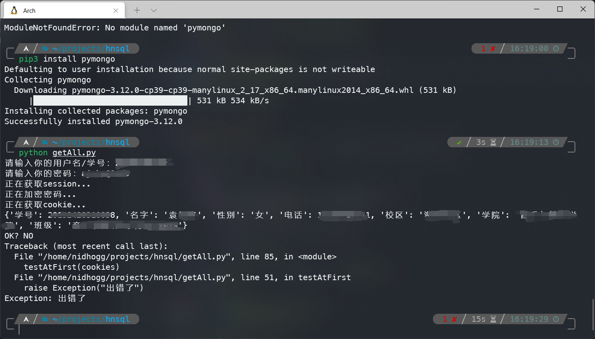

## 抓包环境

我抓包的环境是 Android 10 真机 + magisk + LSPosed，这样的选择也是无奈之举，缺一不可。

magisk —— 自从 Android 7.0 开始，系统不再信任用户证书，所以我们需要写入系统证书，这需要 system 可写，一般有 root 就差不多了。
到了 Android 11，管得更紧了，system 不能写了，得要 magisk 模块才能写入我们自己的证书。
要抓 https ，导入抓包工具生成的证书是必不可少的。

LSPosed —— 今日校园采用了单向认证的方式来防止抓包，简单点来说就是客户端会校验服务器证书，于是需要一个 xposed 模块来 hook 掉，然后去掉这个校验。
而目前感觉在高版本的安卓上能用上 xposed 并且影响不大的估计就只有 LSPosed 了。
想要抓到关键数据，去除证书校验是必不可少的。


假如是双向校验，同时很难逆向 app ，不妨换个思路，想办法搞到 app 里面的证书然后导入到你所选用的抓包工具中。\
而抓出 app 里面的证书，一般只需要解包 app ，查一下资源，没有就去 dex 里面翻一下，也可能在 jni 层里面，一般来说都是一串很长的字符串一样的，比较容易找到，也不需要什么逆向的技术。\
假如不能直接找到，但是 so 里面上万的函数，很明显，开发者有意为止，知难而退，不能不知好歹。


当然，也可以选择模拟器，我一般没用模拟器，用的话也只是用一下 VMOS pro，这方面我没有推荐的，都没用过。
pc 上的模拟器或许也不错。

### 抓包工具

抓包工具我选择的是 burpsuite pro，我笔记本上唯一的抓包工具。

不过我最先开始抓包的时候，是在手机上使用 httpcanary 抓的包，觉得还有很多地方值得测试一下，才开始用 burp 抓包。

至于 burp，有钱就买正版，没钱就用盗版。这年头，burp 破解一抓一大把，github 上也有已经封装好的。

当然，选用 burp 存粹是因为，里面的 repeater 模块特别好用，我每次抓包的时候发现可疑的就丢进去，特别好用。

### 配置

有了以上这些还不够抓包。\
首先得确保手机和电脑能直接通信，连同一个局域网就好了。\
第二得保证手机发的包走笔记本走，也就是将笔记本设为代理服务器。\
第三得保证手机安装了 burp 导出的证书，并且要是系统证书，还得过单向认证，这通过配置手机就可以搞定。

在确保了第三点之后，配置起来是非常简单的，打开 cmd，输入`ipconfig`就可以知道自己笔记本在局域网里的 ip 地址


接下来将手机连的局域网（和笔记本是同一个）设置一下代理为笔记本的 ip，至于端口，可以随意，默认 8080 就好了，下一步可以配置


不过最后还有一点要注意，burp 默认只监听本地的网络流量，端口设在 8080，是不允许其他 ip 的流量走这个代理的，不过可以很简单地设置一下就好了


现在已经可以成功抓取今日校园的包了，不过为了更加细致地分析，配置一下抓取 response 是一个不错的选择


我一般的设置就是这样，可以抓取请求的回包。

最后假如使用 burp，将 intercept on 改为 intercept off。\
因为一开始抓包，对应用发送的包完全不了解，一个一个看缺点很多。\
一个是太多了，看不过来， 对程序的逻辑还不是非常清楚，得仔细看才能知道，累。\
一个是，一般设置了网络延迟，看几个包可能就被认为是网络不佳，应用的行为发生改变。

## 了解应用

抓包之前彻底了解一下应用是可取的，哪些地方会和服务器交互，哪些地方有可疑之处，哪些地方可能存在一些未验证的行为等等。\
比如编辑个人签名的时候，客户端限制是 40 字，这里并不像网页那样好直接修改，这里就可以通过抓包测试一下超过字数会怎么样。\
在抓包之前先了解一下，抓包的时候可以有针对性地对某一个模块或者功能去测试，会简单许多。\
当一切都准备好了，抓包基本上就是简简单单。

## 针对个人信息

### 抓取个人信息

针对这类应用，从个人主页开始入手一般是比较简单的，也可以获取相当多的有效信息。\
非常容易就可以抓到想要的，比如个人用户信息


先发送到 repeater 留着备用。


这里有几个注意点，一个是请求没有添加任何的内容，只是携带了 cookie 还有一些 http头，所以不能直接通过这个去获取他人的数据。
之前测试很多应用的时候，这里请求的时候会携带个人的 id 之类的，然后后端不做验证，导致了信息泄漏。

其次，返回的个人数据看起来没什么用，其实很有用，比如字段。底下还有很多行，包含很多字段。
当需要猜测字段的时候可以从这里入手，接下来我就是多次使用了这个技巧。

另外，仔细查看返回的内容，还可以获取到一些应用里面看不到的信息，比如 id，这可以做很多事。
比如今日校园没有提供搜索他人账号的功能，但是可以访问他人的主页，通过替换 id 就有可能访问到替换 id 之后的主页，除此之外还有太多用途。

已经抓到了获取个人信息的关键包，那么剩下的，个人主页这里最有意义的就只剩下两个了：

1. 脱离限制修改个人信息
2. 任意访问他人主页

看起来后者意义也不是特别大，但毕竟是应用内做不到的事。而前者的危害就非常大了，有时候不经意间就会有大问题。
接下来就逐个来测试。

### 脱离限制修改个人信息

为了尽可能少抓到无用的包，我的建议是先把代理关掉，点开编辑个人信息的页面（这里可能有很重要的数据包，可以单独测试），然后再打开代理。
还有一点很关键，把之前的 intercept off 改成 intercept on，因为这个时候目的明确，就是要抓那一个包。


注意到这里的页面，不仅可以修改信息，还可以设置哪些数据可以被别人看见，这也值得测试，不过先编辑用户数据吧。

随便改一项，然后点击保存，不出所料的话，一定会发送一个数据包告诉服务器数据改了。
不管怎么加密，总会有，如果抓不到，那就有可能是通过 tcp 等，没有上层的 http。
假如是这样，可以不用继续了，很明确了，开发团队不想让你看见，都明确不给了，还要搞，不就是作死。

我修改一下我的性别来看看。

然后我很失败地几次都没找到，不知道为什么（应该是我 options 里面改了请求截取的规则，也懒得改了，反正基本上都知道是怎么回事），不得已去翻了一下 history 和 sitemap，还是很容易找到了。


另外，为了网络畅通和不抓一些无用包，可以选择没有动手抓包的时候关掉 wifi，这样就算是流量没有经过代理了。
尽量不要在 burp 里面设置 filter，因为还不了解有哪些域名值得注意。（过滤掉 google analysis 之类的一般没关系）

二话不说，直接发到 repeater 模块，直接开干。（截取修改数据包是非法行为，但是自己发包，没干坏事一般没事，所以截取包的时候还是不要直接改的好）


请求极其简单，回包看起来就像是请求个人信息一样。
这也很正常，因为编辑完会跳到个人主页。

那么就开始测试，修改各种信息，使其不合常理，观察服务器返回。

先从签名长度入手，直接将下面这段 brainfuck 代码填进去，顺便告诉解密的人最后用 utf-8 编码，这远远超过 40 个字符了。

```brainfuck
decode as utf-8++++++++[>>++>++++>++++++>++++++++>++++++++++>++++++++++++>++++++++++++++>++++++++++++++++>++++++++++++++++++>++++++++++++++++++++>++++++++++++++++++++++>++++++++++++++++++++++++>++++++++++++++++++++++++++>++++++++++++++++++++++++++++>++++++++++++++++++++++++++++++<<<<<<<<<<<<<<<<-]>>>>>>>>------.+++++++++++.--.+.<<<<<.>>>>++++++.>+.<---.++++++++.<<<<.>>>>>>>>>>>>++++.<<---.<<.>>>>+++.<<<<------.<<++++.>>>>>>--.<<<----------.<<<++++.>>>>>>.<<<.<<<.
```


观察请求和返回，返回很明显，成功写入了，也没有截断（太长了，这里截图截不出来）

那么接下来，继续增加长度，会怎么样呢。


啪，服务器直接报错了，有趣，返回都混在一起，不好看，用 echo 输出一下来看看


好家伙，这不得了，信息量巨大。但此时最好什么也不要干，干什么都是在作死，人可以装逼，但不能干坏事。
接下来可以干的就是正常范围内修改个人信息装逼，除此之外最好什么也不要动。

### 随意修改用户数据可见性

当然，测试其他东西是可行的，比如测试用户数据可见性，还是老方法，精确定位数据包抓取。
这里我就偷了个懒，直接看 sitemap，其实通过名称猜用途大多数时候都是对的。


可以看到，发包格式是非常简单的。
DISABLE 就是不可见嘛，ENABLE 就是可见嘛。
NAME 对照之前获取到的个人信息里面的字段，应该是名字了，我操作的时候也是名字。
这个时候抓到的个人信息里面的字段就有用了，因为编辑界面（上面有）有些数据不能自由选择，这个时候就需要外挂手段了。

大部分时候后端处理数据都是选出来修改，这个时候外挂手段是没用的

直接丢到 repeater 里面，开搞。从个人信息那里可以知道学号的字段是 studenNo，按照格式全大写就是 STUDENTNO。于是


看起来成功了，不过不代表没有返回就是正确的。
但有个很简单的手段测试是否正确，不需要别人。

那就是乱填一个字段上去，假如也是 null 返回，那就...基本上玄了，反之，基本上就是正确的。


ohhhhh，那么一切 ok！
不过最后我上报漏洞的时候，找了我的女同学来协助我，发现那些不能设置为不可见的，本来就是不可见的，即使设置为可见别人也看不见，于是还是废了。

### 任意访问他人的主页

要想任意访问他人的主页，那肯定要 id 之类的，不过 id 有好几个，而且还不能确定是不是 id。不过这并不难，抓包解决问题。\
获取他人的信息，主要有两个 api，但是因为一些原因，我不能写出来，可以自行测试。\
但是我在抓包的时候，发现获取他人信息和增加他人的访问数是分开的，而且增加他人访问数的 api 调用一次就加一次，非常离谱，可以直接刷满。配合一个有效的 id 生成器，可以无视任何障碍去吸引所有用户的注意。\
最关键的是，获取他人信息的时候，可以获取到一些不应该出现的数据，比如下面这样。\
先通过个人信息访问到有效信息。


接下来，通过我以前写的一个小玩意，稍加修改就可以获取到他其他的个人信息。如下图\
先修改一下我写的代码，（我写的代码是直接把所有用户信息存入一个 mongodb 数据库里，所以在一开始的测试处修改）


接下来运行就可以拿到这个家伙其他的数据，更加关键的是，这只是一部分，我选出来的那部分。



## 针对问答广场

问答广场我已经测试过了，一个是存在 xss，不过得绕过 waf，另外一个则是越权删除评论。\
对于 xss 的判断也不能说完全确定吧，但至少可以写入 html，然后 html 里还可以写 js ...\
使用的技巧也只不过是前面提到过的，非常简单。\
发表评论->抓包->丢入 repeater->编辑内容（可以包含html代码）->成功\
删除评论->抓包->丢入 repeater->编辑删除的评论的 id->成功删除，越权删除他人评论\
嵌入任何网页


返回访问者的学校信息


## 后记

本文仅供参考交流，任何行为均与本人无关。
