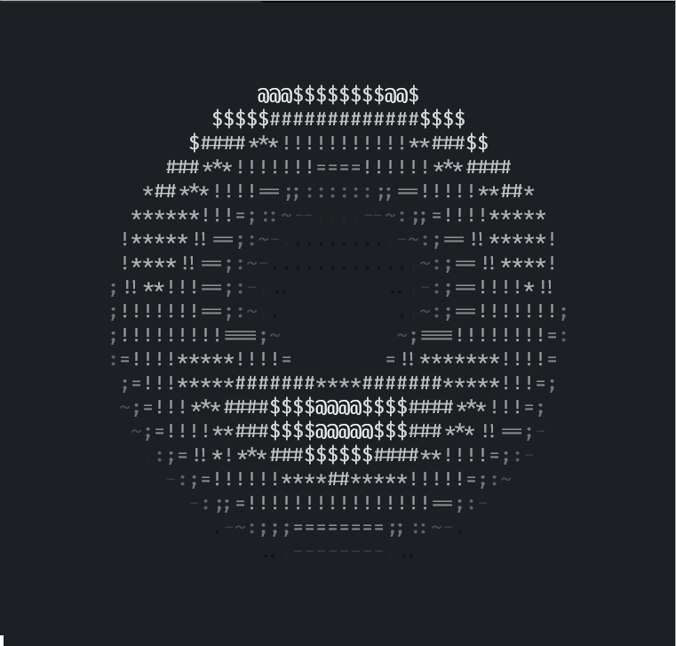
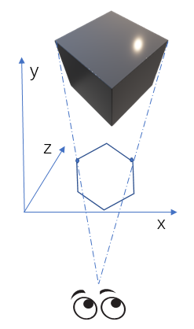
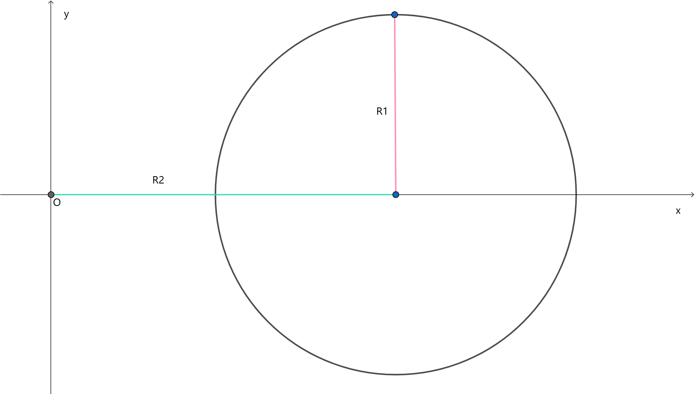
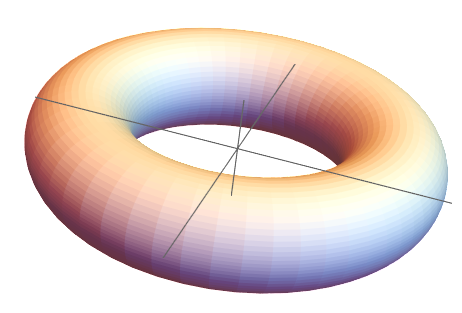
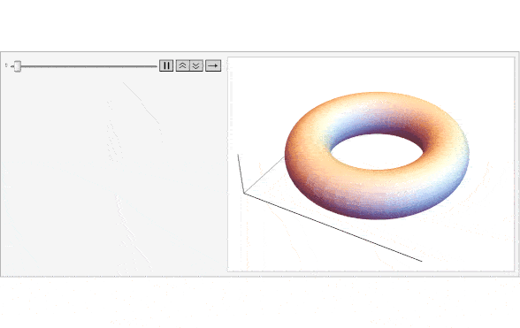
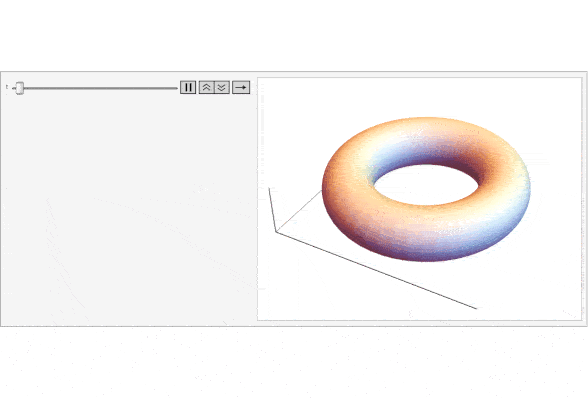

## 前言

这篇文章是在看了 [how donut.c works](https://www.a1k0n.net/2011/07/20/donut-math.html) 之后写的，或许这篇文章应该叫做《在 Rust 中复刻 donut.c》。 \
但由于原文中一些表述过于简略，并且在 Rust 中实现并且是实现一个更强的版本（增强 3D 效果和添加颜色，自动适配终端大小等），并在最后对 Rust 代码初步做一点混淆。
我一下子不知道取什么标题，干脆就叫终端输出甜甜圈这样看起来不解其意的标题。

假如不知道 donut.c 运行输出的效果，下面这个是我在 Rust 中完全复刻输出的效果:


这个是已经增强了光照的，在只有不到 8 fps 的 gif 中效果大打折扣，但实际在终端中几十帧的时候相当不错。

这篇文章大体上分为两部分，第一部分会详细地介绍背后的数学原理，第二部分会一步步用 Rust 代码实现。 \
第一部分与原作者不同，我不仅会给出该怎么做，还会给出为什么这么做。 \
第二部分在用 Rust 实现了 donut 的基础上会选择增强效果以及和原作者一样给出一个混淆的源代码。 \
混淆后的源代码如下:
```rust
                    use std::{ time,
               thread,f64};fn main(){let s
           =f64::consts::PI;let (w,h)= (60,26
        );let k= 30.0;let mut l=Vec::new();for i
      in 0..=11{let c=".,-~:;=!*#$@".chars().nth(i)
    .unwrap();let s=format!("\x1B[38;5;{}m{}",233+2*i
    ,c);l.push(s);} let(mut a,mut b)=(0.0_f64,0.0_f64);
   println!( "\x1B[2J");        loop {let((c,i),(j,q))=(a.
 sin_cos(),b.sin_cos(              ));let(mut o,mut m) = (
vec![" ";w*h],vec![                 0.0;w*h]);let mut p=0.0;
while p<2.0*s{let(n                  ,g)=p.sin_cos();let mut
t=0.0;while t<2.0*s                  {let(p,ct)=t.sin_cos();
let r=|xi,yi|{let(u,                 v)=(xi*c*n+yi*i,xi*g);
(u*q-v*j,u*j+v*q,yi*c              -xi*i*n)}; let(e,f)=(ct+
 2.0,p);let(x,y,z)=r(e,           f);let z=1.0/(z+5.0);let(
  x,y)=((30.0+k*z*x)as usize,(13.0-k/2.0*z*y)as usize);let
   k=r(ct,p);let n=8.0*(k.1-k.2);let g=w*y+x;if y<h &&x<w
    &&z>m[g]{m[g]=z ;o[ g]=l.get(n as usize).unwrap_or(
     &l[0]);}t +=s/128.0;}p+= s/128.0;}println!("\x1B\
      [H{}",o.chunks(w).map(|l|l.concat()).collect::<
        Vec<String>>().join("\n"));thread::sleep(
           time::Duration::from_millis(32))
                 ;a+=0.07;b+=0.03;}}
```
一直以可读性高作为目标的 rustacean 可能会惊奇，如此严格的 Rust 也可以做到。 \
但事实上，我在混淆的时候相当简单！在用 Rust 实现的最后一部分我会给出一些我自己的经验。

## donut 中的数学原理

### 解决投影的形状

其实说起来这个如同魔法一般的东西背后一句话就能解释清楚: 将三维物体投影到固定的一个平面。 \
比如地上的影子就是一个很好的例子，至于为什么影子看起来并不立体，那是因为影子并没有保留与物体的距离造成的光照强度的变化等。 \
又或者镜子，镜子中的像一般被称为虚像，实际上也可以理解为一种投影[^1]。镜子中的像几乎完全保留了因为距离、阴影等造成的光强变化以及颜色，所以看起来就很真实。 \
我们要做的就是希望能找到一种投影能够使得我们的甜甜圈”看起来“非常立体。 \
实际上也非常简单，为了使得人眼看起来真实，首先就是形状要正确。如下图:



[^1]: 虽然一般并不认为镜子中的像算作投影，但这里看作是投影完全没问题。按照数学上的定义来说，即满足 $P^2\begin{bmatrix}x\\\ y\\\ z\end{bmatrix}=P\begin{bmatrix}x\\\ y\\\ 0\end{bmatrix}=\begin{bmatrix}x\\\ y\\\ 0\end{bmatrix}$ ，也就是 $P^2=P$

这个图不是很精确，也存在一些谬误[^2]。不过应该足够传达意思了。 \
这有点类似于三视图，不过这是任意选了一个角度去看。这里只画了两个点，因为不准确，无法画出其他点。 \
一个正方体在一些角度下会是类似于正六边形的形状。现在想象 xy 平面上放一块布，那么布上面的正方体的投影也应该类似于正六边形。 \
于是乎，现在就是要解决按照这个模型，怎么做到 $(x,y,z) -> (x, y, 0)$。按照这个模型，我们就可以在画布上显示一个至少不会让人觉得不真实的画面。
这个画布完全可以是我们的屏幕。 \
注意，将 z 轴放置在水平面上而不是常见的竖直向上，这个是特意的。在实现的时候，我们就是选择了一个特定的 z 平面。
选择 x 轴或者 y 轴作为被”压缩“的轴也是完全可以的，但我个人更习惯于二维存在于 xy 平面而不是 xz 平面或者 yz 平面。

[^2]: 不论是从大小比例还是从眼睛成像的原理来看，这个图都是不”正确“的。但在这里无伤大雅，仅是示意图。

于是，可以来细看这里的坐标变换的关系，怎么样把 $(x,y,z)$ 变换到 $(x,y,0)$。 \
实际上也非常简单，假如抛弃 x 轴，从上图的右侧来观察。对于正方体最顶上那一点，设为点 A，于是有：


这里为了 z 不出现负值，将眼睛移动到了原点附近，画布也需要移动到一个固定的 z'。 \
那么，很容易根据这里仅有的两个三角形相似得到:

<div>
$$
\frac{x'}{x}=\frac{z'}{z}\longrightarrow x'=\frac{z'x}{z}
$$
</div>

对于 y，我们也可以得到类似的结果:

<div>
$$
\frac{y'}{y}=\frac{z'}{z}\longrightarrow y'=\frac{z'y}{z}
$$
</div>

于是乎，x 和 y 的坐标就确定了，z 是一个固定的值 z'。在原文中将 z' 当作一个参数 k1，这里也将 z' 当作一个参数 k1，下文不在赘述。

但是等等，工作并没有完全结束。第一个问题就是，我们不可能计算表面积上的每个点然后投影上去，因为我们无法透视，我们无法透过正方体看到正方体背对着我们的那一面。
我们必须想个办法来解决。第二个就是，我们将眼睛放在原点，那么我们正方体最好是中心正对着原点，不然的话，正方体的投影就不在画布的中间。

对于第一个问题，原作者使用了一个巧妙的办法，那就是用 $\frac{1}{z}$。$\frac{1}{z}$ 越大，那么 z 越小，离眼睛越近。
于是可以用一个矩阵，初始化为全 0 (z 无限大，离眼睛无限远，不可见)，包含的是画布上每一个点的 $\frac{1}{z}$ 的值，遍历整个表面，不管是否可见，大的 $\frac{1}{z}$ 覆盖小的，最后得到的就是可见的那部分。
实际上，这个办法并不完全正确，理应计算 $(x, y, z)$ 到原点的值才对，但是对于甜甜圈这样简单的图形，这个近似的办法倒也不错，计算量也很小。
另外在 x 和 y 的坐标中也有 $\frac{1}{z}$，于是乎就可以免去多次做除法运算，会更快一些。

对于第二个问题，我们之后构建的甜甜圈，中心是正对着原点的，经过变换之后在画布中央。

### 构建甜甜圈

甜甜圈是一种很简单的形状，简单来说就是一个圆绕圆外一个固定的轴旋转一周得到。 \
假如有基本的大学高等数学知识，应该对这类旋转体不陌生。但在此处，会使用旋转矩阵来统一旋转。

首先构建一个圆，在原点附近 (之后会平移一下，所以不用担心甜甜圈和眼睛的距离为 0):

<div>
$$
(x, y) = (R2 + R1\cos\theta, R1\sin\theta),\theta \in [0,2\pi]
$$
</div>

这是一个简单的参数方程，对参数方程略有了解的话，应该无需解释了。假如完全不懂参数方程，只需要知道这个表示的是下面这个圆就好了:



接着用选装矩阵让这个圆绕 y 轴旋转一周。对旋转矩阵不了解也没关系，旋转矩阵就是为了让一个图形绕一个轴旋转。 \
想象一下，这个圆绕着 y 轴旋转的轨迹就好了。得到参数方程:

<div>
$$
\begin{align}
\begin{pmatrix}
  x \\
  y \\
  z
\end{pmatrix}
&=
\begin{pmatrix}
  \cos\phi  & 0 & \sin\phi \\
  0         & 1 & 0        \\
  -\sin\phi & 0 & \cos\phi
\end{pmatrix}
\begin{pmatrix}
  R2+R1\cos\theta \\
  R1\sin\theta    \\
  0
\end{pmatrix} \\
&=
\begin{pmatrix}
  (R2+R1\cos\theta)\cos\phi \\
  R1\sin\theta              \\
  (R2+R1\cos\theta)\sin\phi
\end{pmatrix}
,\theta \in [0,2\pi],\phi \in[0,2\pi]
\end{align}
$$
</div>

看起来有一点吓人，但其实只需要计算就好了，这个方程最后的样子无所谓。
对旋转矩阵不了解的话，可以看一下[旋转矩阵](https://zh.m.wikipedia.org/zh-hans/%E6%97%8B%E8%BD%AC%E7%9F%A9%E9%98%B5)。维基上为了突出准确性，用了很多专有名词。
相较而言[知乎这篇文章](https://zhuanlan.zhihu.com/p/183973440)通俗易懂一些，对数学没什么要求。


这里和原文不同，一律使用惯用的列向量右乘旋转矩阵。 \
原文中的行向量左乘旋转矩阵的做法，应该需要将旋转矩阵转置才对。 \
另外，原文中基础代码实现，旋转的方向各不相同，比较混乱。


得到的就是下面这个圆环[^3]:



圆环的中心就在原点，至此已经构造出了这个圆环。

[^3]: 其实这个并不是上述参数方程画出来的，我试图在 mma 中画出上述参数方程时，莫名其妙只能画出半个。于是用内置的 `Torus[]` 代替了。

### 让甜甜圈动起来

我们已经构造出了一个甜甜圈，但这只是静态的，多少有些无趣，接下来就让甜甜圈动起来。

还是一样的利用旋转矩阵，但这里利用绕 x 轴旋转和绕 z 轴旋转来让它动起来。


绕 y 轴旋转是无意义的，因为我们就是通过绕 y 轴旋转一个圆来得到圆环，因此这个圆环是关于 y 对称的。


首先是绕 x 轴旋转，公式的推导暂时先放在后面 (基本和前面绕 y 轴旋转一致，重复度高)。 \
这里给出一个直观的动画来表示按 x 轴旋转。



然后是绕 z 轴旋转，大概就是这样:




这两个动画的原点 $(0,0,0)$ 都应该位于甜甜圈的中心，但 mma 不允许搬动坐标系，就只能这样看了。这里的坐标系和之前看立方体的坐标系是一致的。


单一的绕 x 轴和绕 z 轴旋转都显得有点单调，于是我们可以复合一下绕 x 和绕 z 轴旋转。 \
最终的方程如下:

<div>
$$
\begin{align}
\begin{pmatrix}
  x \\
  y \\
  z
\end{pmatrix}
&=
\begin{pmatrix}
  \cos\beta & -\sin\beta & 0 \\
  \sin\beta & \cos\beta  & 0 \\
  0         & 0          & 1
\end{pmatrix}
\left \{
  \begin{pmatrix}
    1 & 0          & 0           \\
    0 & \cos\alpha & -\sin\alpha \\
    0 & \sin\alpha & \cos\alpha
  \end{pmatrix}
  \left [
    \begin{pmatrix}
      \cos\phi&0&\sin\phi \\
      0&1&0 \\\
      -\sin\phi&0&\cos\phi
    \end{pmatrix}
    \begin{pmatrix}
      R2+R1\cos\theta \\
      R1\sin\theta \\
      0
    \end{pmatrix}
  \right ]
\right \} \\
&=
\begin{pmatrix}
  t_2\cos\beta - t_1\sin\beta \\
  t_2\sin\beta + t_1\cos\beta \\
  R1\sin\theta - (R2 + R1\sin\theta)\cos\alpha\sin\phi
\end{pmatrix}
, \theta\in[0,2\pi],\phi\in[0,2\pi] \\
其中 \\
t_1 &= R1\sin\theta\cos\alpha + (R2 + R1\cos\theta)\sin\alpha\sin\phi \\
t_2 &= (R2+R1\cos\theta)\cos\phi
\end{align}
$$
</div>

值得注意的是，$\alpha$ 和 $\beta$ 并没有说明取值范围。实际上，这两个角度任取一个值，上面的方程表示的就是一个某种旋转之后的圆环。
我们只需要连续地对 $\alpha$ 和 $\beta$ 取不同的值，就可以产生动画了。

### 光照

这一部分是最关键的，之前的几部分合起来，只是将形状正确地投影了出来。
这样的效果可不是很好，这和影子没有什么区别——只有形状，没有细节。

在这里，除了光照以外其他的细节就无需考虑了，毕竟我们的甜甜圈表面没有什么纹理可言。 \
但光照同样不简单。

首先是物体是自发光，还是外部的光源？ \
对于自发光，我只能说我无法处理，这是源于我对自发光到底是散射出任意角度同强度的光还是任意角度不同强度的光或者是其他的这个问题没有答案。 \
对于外部光源，只需要确定是何种光源 (平行光或者是点光源)，以及合理地处理表面对光的反射就好了。

#### 处理光的反射

如何处理表面对光的反射，一个简单的办法当然是光线方向的向量和表面法向量的点积。


设光线为单位向量 $a$，法向量为单位向量 $n$。那么利用他们的点积 $a\cdot n=|a||n|\cos(\pi+\gamma)=-\cos\gamma$，
可以看出随着光线和法向量之间的夹角的减小，它们的点积也会随之减小。而夹角越小，反光程度越强，也就是反射的光的强度和它们的点积成反比。 \
于是我们完全可以用点积来确定物体表面的”亮度“。不过我们并不打算使用光线方向的向量，而是使用与光线方向相反的向量，这是为了让它们的点积为正值。
并且反射光的强度和会呈现出正比的关系。

#### 确定光源

使用平行光作为光源是简单且恰当的，使用点光源的话，需要考虑不同位置的光线方向的单位向量并不相同，这稍微有点难计算。 \
事实上，我在甜甜圈这个例子上用过非常多种光源，但大多效果并不理想，即使其中一些完全就是生活中常见的光源——在物体上方的点光源。 \
最终我还是采用了和原作者一样的光源: $(0,-1,1)$，这不是一个单位向量，但是易于计算，模不为 1 所造成的结果在代码实现的时候可以轻易解决。 \
使用这个光源的话，光线大致如下:


但需要注意的是，在真正实现的时候，会使用光源方向的负向量，也就是 $(0,1,-1)$

### 平移甜甜圈

虽然已经完全从数学上攻克了“甜甜圈难题”，但是事情还没有完全结束！ \
我们的甜甜圈中心在原点，眼睛也在原点，这让甜甜圈和眼睛的距离可以为 0 甚至为负，所以我们必须要平移甜甜圈到合适的位置。
这里可以使用 K2 作为平移的距离的参数。另外，我们没必要在旋转之前就平移，那样会让式子非常复杂，之前的矩阵计算也要重新计算了。
这里完全可以在旋转变换之后再平移，也就是只影响投影的坐标变换，于是有:

<div>
$$
\begin{pmatrix}
  x'\\
  y'
\end{pmatrix}
=
\begin{pmatrix}
  \frac{k1\cdot x}{k2+z} \\
  \frac{k1\cdot y}{k2+z}
\end{pmatrix}
$$
</div>

## rust 实现

对甜甜圈背后的原理已经完全了解了，接下来可以实现代码了。


在下文的实现中，大量地使用了终端控制符，在 Windows 默认的终端上可能无法得到结果。(包含颜色的版本是肯定不行的)
这一点无法避免，在原作者的代码实现中，也使用了终端控制符来擦除屏幕。


### 极简实现

```rust
fn main() {
    let swidth = 60; // 画布的宽
    let sheight = 26; // 画布的长
    let r1 = 1.0; // 圆的半径
    let r2 = 2.0; // 圆心向 x 轴正方向平移距离
    let k2 = 5.0; // 甜甜圈整体平移距离
    let k1 = 30.0; // 画布位置

    let (mut a, mut b) = (0.0_f64, 0.0_f64); // x z 轴旋转的角度

    let (mut output, mut zbuffer) = (vec![' '; swidth * sheight], vec![0.0; swidth * sheight]);

    // 擦除整个屏幕
    println!("\x1B[2J");
    loop {
        // 这个无限循环的每一次循环都会输出一帧画面

        let (sina, cosa) = a.sin_cos();
        let (sinb, cosb) = b.sin_cos();

        // 遍历 θ 和 ϕ 以构建整个甜甜圈
        // 内层遍历 θ 是为了构建圆
        // 外层遍历 ϕ 是为了将圆变成圆环
        let mut phi = 0.0;
        while phi < 6.28_f64 {
            let (sinp, cosp) = phi.sin_cos();

            let mut theta = 0.0;
            while theta < 6.28_f64 {
                let (sint, cost) = theta.sin_cos();

                // 旋转
                let rotate_yxz = |xi, yi| {
                    let t1 = xi * sina * sinp + yi * cosa;
                    let t2 = xi * cosp;
                    (
                        t1 * sinb + t2 * cosb,
                        t1 * cosb - t2 * sinb,
                        xi * cosa * sinp - yi * sina,
                    )
                };

                // 产生圆上的一点
                let (x1, y1) = (r1 * cost + r2, r1 * sint);

                // 旋转到正确位置
                let (x, y, z) = rotate_yxz(x1, y1);

                let zd = 1.0 / (z + k2);

                // swidth / 2 和 sheight / 2 是为了将画布的中心设为原点 (0,0)
                // y 坐标中除以 2.0 是因为一个字符的高大约是宽的两倍
                let (x, y) = (
                    ((swidth / 2) as f64 + k1 * zd * x) as usize,
                    ((sheight / 2) as f64 - k1 * zd * y / 2.0) as usize,
                );

                // 计算光照，用 8.0 去乘是得到一个近似结果，但足够用了
                let t = rotate_yxz(cost, sint);
                let n = 8.0 * (t.1 - t.2);

                let o = swidth * y + x;

                // zd 大于 zbuffer 中对应的值时说明目前处理的这个点离眼睛更近，更应该被看到
                // 否则就是看不到的，不去处理
                if y < sheight && x < swidth && zd > zbuffer[o] {
                    zbuffer[o] = zd;
                    let c = ".,-~:;=!*#$@".chars().nth(n as usize).unwrap_or('.');
                    output[o] = c;
                }
                theta += 0.03;
            }
            phi += 0.03;
        }

        // 输出整个画面
        println!(
            "\x1B[H{}",
            output
                .chunks(swidth)
                .map(|l| l.iter().collect())
                .collect::<Vec<String>>()
                .join("\n")
        );

        // 为下次循环做装备
        std::thread::sleep(std::time::Duration::from_millis(32));
        output.fill(' ');
        zbuffer.fill(0.0);

        // 旋转整个图形
        a += 0.06;
        b += 0.02;
    }
}
```

有了上面的数学推导再加上注释，这几行代码应该是不难理解的。

但是有些 rust 代码值得注意:
浮点数后面经常加了 `_f64` 如 `0.0_f64`，这是必须的，因为 rust 虽然默认的浮点数是 `f64` 但是调用 `f64` 上的方法时会要求注明类型。 \
诸如 `\x1B[2J` 这种 `\x1B[xx` 是终端控制符，输出之后并不会显示，而是产生某种效果，如移动光标、清除屏幕、设置颜色。
这需要终端支持，但目前而言绝大多数 linux 上的终端和现代的 windows 上的终端 (windows terminal、fluent termainl...) 都是支持的。\
并没有使用二维数组，而是使用 `let o = swidth * y + x;` 去计算正确的位置，因为二维数组在最后输出整张画面时会让链式调用非常长，不利于阅读。 \
使用了很多 rust 实用的方法，`chunks()`、`join()`、`sin_cos()` 等，这在 rust 的 std 文档中都有说明。另外多看 std 文档还可以发现非常多实用函数! \
`let n = 8.0 * (t.1 - t.2);` 是因为 `.,-~:;=!*#$@` 包含 12 个字符，下标也就是 [0, 11]。而 $t.1-t.2 \in [0, \sqrt{2}]$。用 8.0 去乘大约就是 [0, 11.4]，这是个近似的值。 \

### 让数值更精确

在上面的极简实现中，数值都是使用诸如 `6.28_f64` 这种。
但实际上 rust 内置了 $\pi$ 的一个值，不妨使用这个值，这会让代码的意义更加明确，也不会使代码变慢许多。

```rust { hl_lines=[1, 12, 16, 20, 22, "28-29"] }
use std::f64::consts::PI;

fn main() {
    // ...

    loop {
        // ...

        let mut phi = 0.0;
        while phi < 2.0 * PI {
            let (sinp, cosp) = phi.sin_cos();

            let mut theta = 0.0;
            while theta < 2.0 * PI {
                // ...

                theta += PI / 2.0_f64.powf(7.0);
            }
            phi += PI / 2.0_f64.powf(7.0);
        }
        // ...

        // 旋转整个图形
        a += PI / 2.0_f64.powf(6.0);
        b += PI / 2.0_f64.powf(7.0);
    }
}
```

对于 `let n = 8.0 * (t.1 - t.2);` 这样用 8.0 去乘一个 $[0,\sqrt{2}]$，也是不精确的，可以换成 `let n = 11.0 * (t.1 - t.2) / std::f64::consts::SQRT_2;`


关于性能的影响，可以认为几乎为 0。 \
我在渲染甜甜圈到一个超大的画布 (600x300) 时，进行了更为激进的数值计算上的优化，最后只减少了大约 0.5 ms 的渲染时间，而此时渲染一帧的时间就已经达到了 40ms。
提升大约为 $\frac{1}{80}$ 微不足道。 \
在这个程序中，内循环中多一次除法运算也并不会影响太多性能。


### 让光照效果更明显

使用一系列不同”大小“的 ascii 字符作为光照强度的表示是不错的，但是更加有效的办法是利用灰度值来增强光照。 \
终端并没有输出不同灰度值的直接办法，但是终端可以输出 256 色和 rgb 颜色，这里面就包含了我们需要输出的灰度值。

这里先使用 256 色，因为 rgb 颜色更加复杂，在后文会给出一个彩色的版本使用 rgb 颜色。
在这里我们暂时先只使用 256 色中的 gray color，也就是 232-255。这有 24 种颜色，于是可以取步长为 2。

```rust { hl_lines=["6-10", 12, 29, 42, 48] }
use std::f64::consts::PI;

fn main() {
    // ...

    let mut lighted = Vec::with_capacity(12);
    let chars = ".,-~:;=!*#$@".chars();
    for (i, c) in chars.enumerate() {
        lighted.push(format!("\x1B[38;5;{}m{}", 232 + 2 * i, c));
    }

    let (mut output, mut zbuffer) = (vec![" "; swidth * sheight], vec![0.0; swidth * sheight]);

    // 擦除整个屏幕
    println!("\x1B[2J");
    loop {
        // ...

        while phi < 2.0 * PI {
            // ...

            while theta < 2.0 * PI {
                // ...

                // zd 大于 zbuffer 中对应的值时说明目前处理的这个点离眼睛更近，更应该被看到
                // 否则就是看不到的，不去处理
                if y < sheight && x < swidth && zd > zbuffer[o] {
                    zbuffer[o] = zd;
                    let c = lighted.get(n as usize).unwrap_or(&lighted[0]);
                    output[o] = c;
                }
                theta += PI / 2.0_f64.powf(7.0);
            }
            phi += PI / 2.0_f64.powf(7.0);
        }

        // 输出整个画面
        println!(
            "\x1B[H{}",
            output
                .chunks(swidth)
                .map(|l| l.concat())
                .collect::<Vec<String>>()
                .join("\n")
        );
        // ...

        output.fill(" ");
        zbuffer.fill(0.0);

        // ...
    }
}
```

终端输出 256 色的控制符为 `\x1B[38;2;<color>m` 其中 color 就是 0-255。232-255 是灰度值，逐次变亮，255 最亮。 \
对于 `[&str] to String` rust 提供了 `concat()` 方法，非常方便。

### 增加颜色支持

现代的终端对颜色的支持还远不止于 8 位 256 色，现代的终端基本上都会支持 24 位 rgb 颜色 (r: 红色，g: 绿色，b: 蓝色)。 \
于是我们也可以让我们的甜甜圈拥有渐变色。

不过关于颜色，我个人还没有找到一个非常合适的办法来输出一个非常炫酷的甜甜圈。以下是我的几种尝试:

旋转变色法。设定 r 随 $\theta$ 的变化而变化，$2\pi$ 为一个周期，g 和 b 随 $\phi$ 变化而变化，$2\pi$ 为一个周期。 \
结果: 非常难看，甜甜圈最顶部和最下部颜色区分明显，而且不变色，最关键的是渐变色不明显。

超级旋转变色法。g 和 b 随 $\phi$ 变化而变化，$2\pi$ 为一个周期，同时 r 增加 1。让 r 在“螺旋”的方向上渐变。 \
结果: 甜甜圈看起来更加像一个旋风了，渐变色不明显。

彩色光源法，目前还算可以的办法。在有了上面两个对甜甜圈着色的经验之后，我决定不再对甜甜圈表面着色，而是从光源的颜色入手。 \
由于光源向量是一成不变的，渐变色也需要用一个新的方法生成。
渐变色不过就是在 (r,g,b) 这个三维的坐标系中寻找一条轨迹，我一开始打算使用圆作为轨迹，但空间中的圆的参数方程计算有点麻烦。
最终我采用了一种随机轨迹，同时为了颜色不总是在设定的颜色附近徘徊，我刻意使得颜色的改变并不平衡。

由于使用了随机数，需要一个 crate 来帮助我们生成随机数，这在《the book》第一小节中就使用过，添加依赖就跳过了。 \
rust 代码首先删掉所有关于 `lighted` 的代码，然后添加或添加代码:

```rust { hl_lines=["2-3", "8-10", 16, "19-23", 30, 34, "40-98"] }
use std::f64::consts::PI;
use std::fmt;
use rand::Rng;

fn main() {
    // ...

    let mut color = (128,128,128);
    let mut colored;
    let (mut output, mut zbuffer) = (vec![Colored::default(); swidth * sheight], vec![0.0; swidth * sheight]);

    // ...

    println!("\x1B[2J");
    loop {
        colored = gen_color_char(&mut color);

        // ...
                if y < sheight && x < swidth && zd > zbuffer[o] {
                    zbuffer[o] = zd;
                    let c = *colored.get(n as usize).unwrap_or(&colored[0]);
                    output[o] = c;
                }
        // ...

        println!(
            "\x1B[H{}",
            output
                .chunks(swidth)
                .map(|l| l.iter().map(|c| format!("{}", c)).collect())
                .collect::<Vec<String>>()
                .join("\n")
        );
        output.fill(Colored::default());

        // ...
    }
}

fn gen_color_char(color: &mut (u8, u8, u8)) -> Vec<Colored> {
    let mut rng = rand::thread_rng();

    // 随机加减。+ 和 - 并不平衡，这是为了更加随机，偏离中心，色彩更丰富。
    let mut add_or_min = |a| {
        if a >= 240 {
            a - rng.gen_range(0..=16)
        } else if a <= 16 {
            a + rng.gen_range(0..=16)
        } else {
            a + rng.gen_range(0..=16) - 8
        }
    };

    color.0 = add_or_min(color.0);
    color.1 = add_or_min(color.1);
    color.2 = add_or_min(color.2);
    let (r, g, b) = *color;

    // 修改颜色的亮度
    let lc = |c, l| (c as f64 * l) as u8;
    let mut colored = Vec::with_capacity(12);
    let light_levels = [
        0.50, 0.6, 0.7, 0.8, 0.9, 1.00, 1.00, 1.1, 1.2, 1.3, 1.4, 1.5,
    ];
    let chars = ".,-~:;=!*#$@".chars();
    for (l, c) in std::iter::zip(light_levels, chars) {
        colored.push(Colored::new((lc(r, l), lc(g, l), lc(b, l)), c))
    }
    colored
}

#[derive(Clone, Copy, Debug)]
pub struct Colored {
    color: (u8, u8, u8),
    ch: char,
}

impl Colored {
    pub fn new(color: (u8, u8, u8), ch: char) -> Colored {
        Colored { color, ch }
    }
}

impl fmt::Display for Colored {
    fn fmt(&self, f: &mut fmt::Formatter<'_>) -> fmt::Result {
        let (r, g, b) = self.color;
        write!(f, "\x1B[38;2;{};{};{}m{}", r, g, b, self.ch)
    }
}

impl Default for Colored {
    fn default() -> Self {
        Self {
            color: (0, 0, 0),
            ch: ' ',
        }
    }
}
```

`gen_color_char()` 并没有优化，这是因为它执行的时间相较于内循环计算整个甜甜圈来说完全微不足道。

### 放大和缩小甜甜圈

画一个固定大小的甜甜圈多少有些无趣。
现代的终端都支持缩放了，并且缩放程度相当离谱，比如 windows terminal，最大可以缩放到 1561x270。
这已经算是相当“高”的分辨率了，而我们的甜甜圈还是 60x26，分辨率未免太低了。
将甜甜圈缩放是有必要的，也很容易做到，相关的参数都是线性的，之前的代码可刻意将画布的长和宽分离出来。
rust 实现:

```rust { hl_lines=["2-5", 18, 20] }
fn main() {
    let scale = 1.0;
    let swidth = (60.0 * scale) as usize; // 画布的宽
    let sheight = (26.0 * scale) as usize; // 画布的长
    let (sample_theta, sample_phi) = (sheight as f64 * 2.0, sheight as f64 * 6.0);

    // ...

    loop {
        // ...

        while phi < 2.0 * PI {
            // ...

            while theta < 2.0 * PI {
                // ...

                theta += PI / sample_theta;
            }
            phi += PI / sample_phi;
        }
    }
}
```

### 自适应缩放

能够放大和缩小，但是每次修改都需要重新编译才能改变，即使添加运行时的参数也不能动态缩放，这不太好。
自适应缩放并不困难，实现上相当简单，最关键的就是需要获取终端的高和宽。
使用一个小小的 crate 是很容易做到的。

在 Cargo.toml 中添加依赖:

```toml
[dependencies]
terminal_size = "0.2"
```

修改 main.rs 中的代码:

```rust { hl_lines=[2, "4-15", "18-20", "25-31", "37-61"] }
// ...
use terminal_size::{terminal_size, Height, Width};

macro_rules! init_param {
    ($w: expr, $h: expr) => {
        ($w as f64 / 1.8, $h as f64 * 2.0, $h as f64 * 6.0)
    };
    ($w: expr, $h: expr, $ow: expr, $sample: expr) => {
        (
            $w as f64 / 1.8,
            $sample.0 * $w as f64 / $ow as f64,
            $sample.1 * $w as f64 / $ow as f64,
        )
    };
}

fn main() {
    let (mut swidth, mut sheight) = get_term_size();
    let (mut k1, mut sample_theta, mut sample_phi) = init_param!(swidth, sheight);
    let (mut output, mut zbuffer) = init_matrix(swidth, sheight);

    // ...

    loop {
        if let Some((w, h)) = listen_term_change((swidth, sheight)) {
            (k1, sample_theta, sample_phi) = init_param!(w, h, swidth, (sample_theta, sample_phi));
            (output, zbuffer) = init_matrix(w, h);
            println!("\x1B[2J");
            sheight = h;
            swidth = w;
        }

        // ...
    }
}

pub fn get_term_size() -> (usize, usize) {
    let size = terminal_size();
    if let Some((Width(_), Height(h))) = size {
        // 不要使用 width，甜甜圈占用的空间大约是个正方形，多余的宽度总是为空，极大浪费内存
        // 由于字符的高约等于宽的两倍，所以画布的宽大约要是高的两倍
        (2 * h as usize, h as usize - 5)
    } else {
        (60, 30)
    }
}

pub fn listen_term_change(old: (usize, usize)) -> Option<(usize, usize)> {
    let now = get_term_size();
    if old.0 == now.0 && old.1 == now.1 {
        return None;
    }
    Some(now)
}

pub fn init_matrix(w: usize, h: usize) -> (Vec<Colored>, Vec<f64>) {
    (
        vec![Colored::default(); w * h], // output
        vec![0.0; w * h],                // zbuffer
    )
}
```

### 更多细节上的调整和优化

限于篇幅，关于添加命令行参数、多种样式等此处就略过了。 \
[这里](https://github.com/nidhoggfgg/for-beginners/tree/main/donut/donut_rust)有一个我自己的实现，还算全面，就差一个多线程了。

### 混淆代码

这里使用”混淆“一词不太恰当，毕竟混淆的目的是降低可读性，而将甜甜圈的源代码压缩到甜甜圈的形状更多的是为了好玩和特定的形状。
但我也找不到其他的词来形容了，反正最终的目的就是为了把源代码压缩到特定的形状。
由于我的混淆过程并未记录，还原起来也比较麻烦，但这里可以提供几条有用的建议。

1. 将所有变量名都改为单个字符。这点非常重要，因为变量名不能分割，一旦遇到需要换行的地方就不得以要大幅度调整了。对于字母用尽的情况，可以利用作用域和生命周期来使用同名变量。
2. 使用短的函数名，或者直接全部使用闭包。
3. 尽可能将变量声明放入元组的模式匹配中，如 `let a = 1; let b = 1;` 变为 `let (a, b) = (1, 1);`。一方面是为了压缩代码，另一方面还是因为空格和换行非常随意。比如极端情况下 `let(a,b)=(1,1);` (`let` 和 `(` 之间可以无需空格) 和 `let\n(\na\n,\nb\n)\n=\n(\n1\n,\n1\n)\n;` 也是可以的
4. 许多地方其实无需空格，如: `(1.0)as usize` `if a{` `fn x(){` `{let`等等，几乎所有符号(+{...})和单词(if,fn...)等之间都可以不空格。
5. 许多地方对换行和空格不敏感，如以下几个例子的右端都可以换行和空格: `time::` `a(` `变量名` `:` `const` `let` 等。比如极端情况 `const\nA\n:\nf64\n=\n1.0\n;` 都是合理的。
6. 过度压缩时，可以在空格不敏感处添加空格，或者使用括号、修改变量名等。
7. 先压缩到一个大体上还算像的形状，接着慢慢调整。从上面几条可以看到，rust 的词法分析器相当智能，一行内可以调整的内容很多。
